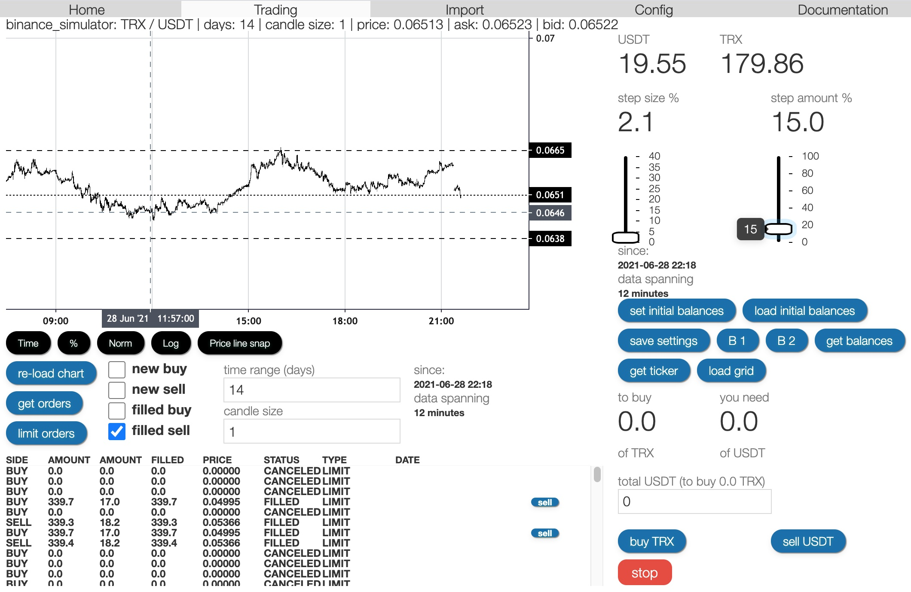

# SEKO

Trading software (fork of askmike/gekko [https://github.com/askmike/gekko])

# Install

Clone this repository and switch to `seco-improvements-grid` branch.
Then install with following command:

    npm install --only=production

NOTE: You may see a vulnerability warning from NPM, dont worry, it's ok))
You also need to install Gekko (SEKO) Broker's dependencies, run:

    cd exchange
    npm install --only=production
    cd ../web/vue
    npm install --only=production
    npm install -g @vue/cli
    vue upgrade 
    npm run build
    cd ../../

# Run

After all the above you can start Gekko (SEKO) by running the following in your terminal:

    node gekko --ui

# What is improved.

User inteface refactored, TradingView chart added, removed unused modules,
removed strategy interface, and all useless TA libraries, 
implemented only one most efficient grid strategy which use only Market Type orders,
removed backtesting since it does not make sence with grid strategy.

